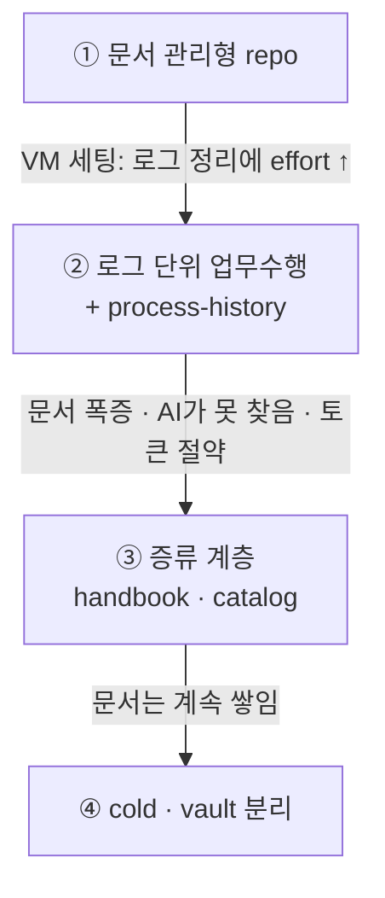
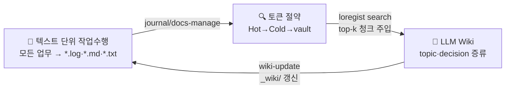
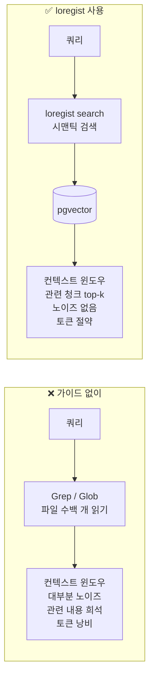
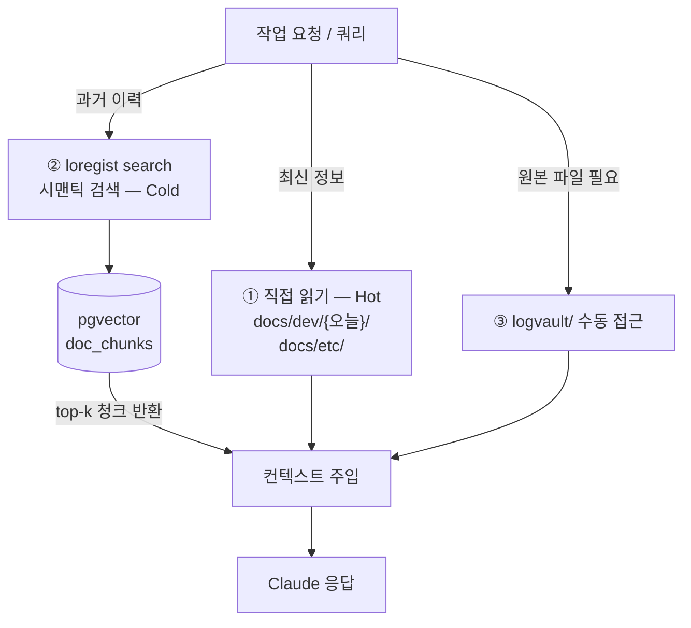
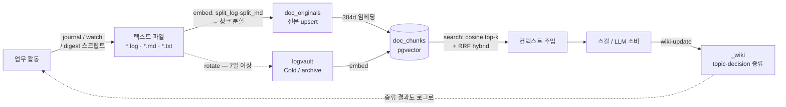
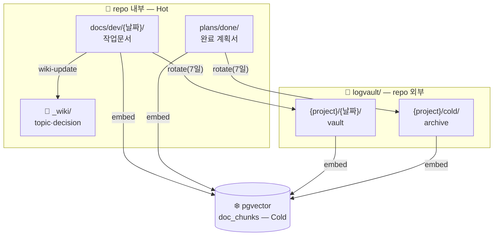
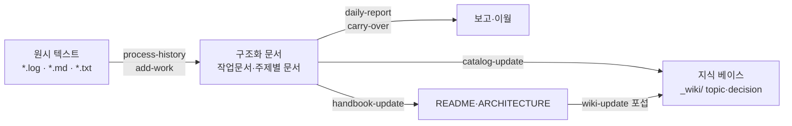

# loregist

→ [README.md](README.md) 로 돌아가기

개인 repo 문서·로그 컨텍스트 검색 인프라.  
LLM이 repo 전체를 무차별 Grep/Glob 탐색하지 않도록, **검색 계층(Hot → Cold vector DB → vault)** 으로 컨텍스트 우선순위를 부여하는 중앙 도구.

→ 사용법은 [docs/public/USAGE.md](docs/public/USAGE.md)를 참조.

---

## 탄생 배경

기획된 도구가 아니다. 업무 방식이 바뀌며 한 겹씩 자랐다.



- **①** 시작은 문서 관리형 repo — 모든 작업을 Markdown 문서로 관리하던 repo.
- **②** VM 환경세팅 중 로그를 보며 다음 작업을 유추했는데, 히스토리 정리에 드는 effort가 컸다. 업무를 `*.log`로 흘려보내고, 정리를 자동화하려 `process-history` 스킬을 만들었다.
- **③** 로그로 일하니 문서가 쌓이고 AI가 필요한 내용을 못 찾았다(토큰도 아끼고 싶었다). 그래서 증류 계층을 뒀다 — handbook은 사람이 쓰는 산문, catalog는 LLM이 로그에서 자동 증류한 색인. catalog가 Karpathy가 말한 **"LLM wiki"**에 해당한다.
- **④** 그래도 문서는 계속 쌓인다. 오래된 건 repo 밖(cold)으로 빼고 원본은 vault에 남겨, 언제든 찾아볼 수 있게 했다.

이 흐름이 아래 [세 원칙](#세-원칙)(텍스트 단위 작업수행 · 토큰 절약 · LLM Wiki)으로 굳었다.

---

## 설계 철학

### 세 원칙

| 원칙 | 역할 | 구현체 |
|---|---|---|
| 텍스트 단위 작업수행 | 모든 업무를 텍스트 파일(`*.log` / `*.md` / `*.txt`)로 기록, LLM이 청크 단위로 소비·생산 | journal, watch, docs-manage 스킬 |
| 토큰 절약 | Hot→Cold→vault 계층 + 시맨틱 검색으로 top-k 청크만 컨텍스트 주입 | loregist search, 검색 계층 |
| LLM Wiki | 텍스트 흐름에서 LLM이 topic·decision을 증류해 지식 베이스 유지 | wiki-update 스킬 |

> *모든 업무가 텍스트로 흐르고, 필요한 것만 컨텍스트에 들어오며, 누적된 지식은 LLM이 직접 정제한다.*



### 왜 만들었나 — 컨텍스트 문제

LLM이 과거 이력을 찾으려 Grep/Glob으로 수백 개 파일을 읽으면 컨텍스트 윈도우가 노이즈로 채워진다. 관련 없는 내용이 많을수록 정작 필요한 내용의 비중이 낮아지고(희석 효과), 토큰 예산도 낭비된다. 히스토리가 쌓일수록 이 문제는 심해진다.

loregist는 이를 구조적으로 해결한다:

- **시맨틱 검색으로 상위 k개 청크만 주입** → 컨텍스트 윈도우 절약, 신호 대 노이즈 비 향상
- **cold 파일을 repo 밖으로 이동** → Claude가 파일시스템을 탐색해도 과거 이력에 닿지 않음 (`.gitignore`로는 막을 수 없고, CLAUDE.md 규칙은 soft boundary라 구조적 보장이 없다)
- **오늘 작업문서만 Hot으로 유지** → 매일 갱신되는 컨텍스트는 직접 읽기, 과거는 검색으로 소환



### 전제: 모든 업무의 로그화

이 시스템이 동작하려면 **업무 활동이 텍스트 파일(`*.log` / `*.md` / `*.txt`)로 기록되어야** 한다. loregist는 embed된 것만 검색할 수 있으므로, 기록되지 않은 업무는 검색되지 않는다.

| 기록 방법 | 설명 |
|---|---|
| `loregist journal "메시지"` | 오늘 날짜 `.log`에 타임스탬프와 함께 append |
| `loregist-journal.command` (더블클릭) | Finder에서 더블클릭 → 대화창에 텍스트 입력 → 기록. 터미널 불필요한 비개발자 진입점 |
| `loregist watch` | 디렉터리 감시 — 파일 변경 시 자동 embed |
| `scripts/examples/github-digest.sh` | GitHub 알림 → `.log` 변환 후 append |
| `scripts/examples/jira-digest.sh` | Jira 업데이트 → `.log` 변환 후 append |
| 직접 작성 | `logvault/{project}/YYYY-MM-DD.log` 형식으로 자유 기록 |

로그가 쌓이면 `loregist embed`로 pgvector에 인덱싱한다. 이후 과거 이력은 전부 `loregist search`로 소환 가능해진다.

## 유사 개념

loregist를 이미 아는 개념으로 위치 짓는다면:

| 개념 | loregist에서의 대응 |
|---|---|
| **RAG** (Retrieval-Augmented Generation) | 핵심 패턴 그 자체. 단, 외부 문서가 아니라 **자기 업무 로그**를 검색 코퍼스로 삼는 개인용 RAG. |
| **벡터 DB / 시맨틱 검색** | pgvector + 한국어 특화 임베딩 모델. 키워드가 아닌 의미로 과거 이력을 소환. |
| **LLM 장기 기억 (long-term memory)** | 세션을 넘어 누적되는 외부 기억 계층. 컨텍스트 윈도우 밖의 이력을 검색으로 되살린다. |
| **메모리 계층 / 캐시 (hot/cold tiering)** | 자주 쓰는 데이터는 가깝게(Hot=직접 읽기), 오래된 데이터는 멀리(Cold=검색)·아카이브(vault). OS의 캐시 계층과 같은 발상. |
| **지식 베이스 / 위키** | `_wiki/`의 topic·decision 인덱스. 단, 사람이 아니라 LLM이 로그에서 증류해 유지. |

요약하면 loregist는 **개인 업무 로그 위의 RAG + hot/cold 메모리 계층 + LLM이 유지하는 위키**의 결합이다.

## 비개발자 빠른 시작

코드·인프라 설정 없이 loregist를 처음 쓰는 경우의 최소 흐름이다.

1. **프로젝트 등록** — `loregist project add` 를 실행하면 대화형으로 프로젝트 키·경로를 입력받아 `projects.toml`에 자동 등록한다.
2. **업무 기록** — `loregist journal "오늘 한 일"` 로 날짜별 로그 파일에 내용을 누적한다.
3. **과거 이력 검색** — `loregist search "검색어"` 로 시맨틱 검색을 실행하면 관련 로그 청크를 상위 k개 반환한다.

이 세 명령으로 기록 → 색인 → 검색 루프를 바로 시작할 수 있다. 상세 옵션은 [docs/public/USAGE.md](docs/public/USAGE.md)를 참조.

## 멀티 프로젝트 설계 ("최소 멀티")

retrofit 비용이 큰 레이어만 멀티로 반영하고, 운영 UX는 단일로 유지한다.

| 레이어 | 방침 |
|---|---|
| DB 스키마 | **멀티** — `project` 컬럼 (나중에 넣으면 전체 재임베딩) |
| 인프라 위치 | **중앙화** — 이 디렉터리에 DB/venv/모델/스크립트 1벌 |
| vault 경로 | **멀티** — `logvault/{project}/` |
| 검색 스코프(UX) | **단일** — 기본 cwd 기준 현재 프로젝트. 크로스는 `--all-projects` |

`project` = `projects.toml` key. cwd/대상 경로에서 자동 추론(`infer_project`), `--project`로 override.  
새 프로젝트 추가는 `projects.toml`에 블록 추가만으로 완료 — 코드 편집 불필요.

### catalog opt-in 설정

LLM Wiki(`wiki-update` 스킬)를 활성화하려면 `projects.toml` 블록에 다음 필드를 추가한다.

| 필드 | 타입 | 설명 |
|---|---|---|
| `catalog` | `true` / 경로 | `true`이면 `{docs_root}/_wiki` 자동 지정. 경로 문자열이면 해당 경로 사용 |
| `handbook` | 경로 목록 | LLM이 스캔할 문서 파일 목록 (glob 패턴 허용). 선언 시 fallback 소스 대신 이 목록만 스캔 (`wiki_sources`는 deprecated, `handbook` 사용 권장) |
| `catalog_readme` | 경로 | `## 카탈로그 개요` 섹션을 자동 갱신할 README 경로. 선언 시 `catalog-update` 실행마다 overview 자동 반영 |

```toml
[projects.my-project]
docs_root      = "path/to/dev"
catalog        = true                                 # _wiki/ opt-in
handbook       = ["path/to/infra.md", "path/to/policy/*.md"]  # 스캔 소스 고정
catalog_readme = "path/to/README.md"                 # overview 자동 갱신 대상
```

`catalog_readme`를 지정하면 `catalog-update` 실행 후 해당 README의 `## 카탈로그 개요` 섹션이 자동 갱신된다 — topic·decision 링크 목록이 README를 카탈로그 뷰로 만든다.

## 검색 계층 (설계 핵심)



각 프로젝트 repo의 CLAUDE.md에는 이 계층을 적용한 "문서·로그 컨텍스트" 규칙 블록이 들어간다(`*.log`, `cold/**` 기본 제외 + 과거 이력은 `loregist search`로).

## 아키텍처

### 데이터 플로우 (전체)

업무가 로그로 들어와 데이터로 변환되고 소비·증류·회수되기까지의 end-to-end 흐름. 이후 절(스택·컴포넌트·저장 계층)은 이 그림의 부분을 확대한 것이다.



| 단계 | 구현 | 핵심 |
|---|---|---|
| **기록** | `journal.py` / `watch.py` / digest 스크립트 | embed된 것만 검색됨 — 기록이 출발점 |
| **임베딩** | `chunking.py`(`split_log`/`split_md`) → `embed.py` | 전문은 `doc_originals`에 upsert, 청크는 `doc_chunks`에 insert |
| **검색** | `search.py` | 쿼리 임베딩 → cosine top-k, `project` 스코프, hybrid는 RRF 융합. cascade 전략은 wiki→hot→cold 계층 조기종료 |
| **소비** | Claude Code 스킬 | top-k 청크를 컨텍스트로 주입해 반복 작업 자동화 |
| **증류** | `catalog_gen.py` (`catalog-update`) | 로그에서 topic·decision을 `_wiki/` 위키로 추출 |
| **회수** | `rotate.py` | Hot(repo) → vault(Cold) 이동. 전문 보존으로 삭제 후에도 복원 |

> 핵심 비대칭: **다량의 원시 로그는 검색 랭킹으로**, **소수의 정제 지식은 LLM 위키로** — 같은 텍스트 흐름의 두 끝이다. 둘은 경쟁이 아니라 파이프라인의 두 끝이다.

### 스택

| 항목 | 내용 |
|---|---|
| DB | PostgreSQL 16 + pgvector + pg_bigm, port **5433**, db/user `loregist`/`loregist`. `doc_chunks`는 `created_at` 월별 RANGE 파티셔닝 |
| 임베딩 모델 | `dragonkue/multilingual-e5-small-ko-v2` (384 dims, ~450MB, 한국어 특화 fine-tune) |
| 검색 모드 | `hybrid` (RRF 융합 기본) / `vector` / `fts` / `like` — hybrid가 골든셋 80% vs 단독 40~60% |
| 검색 전략 | `--strategy` single(기본)/cascade/fusion/speculative — wiki→hot→cold 콘텐츠 계층 다단계 탐색(`--recency-boost` 활성 시 hot→wiki→cold 로 역전). `--tier`로 시간 윈도우(m1~m12) 조절 |
| Python | 3.11 (`.python-version`), venv `.venv/` |

> 검색 모드·전략의 단일 출처는 위 표다 — 컴포넌트·데이터 플로우 절은 이를 요약 참조한다.

### 컴포넌트

| 파일 | 역할 |
|---|---|
| `projects.toml` | 프로젝트 레지스트리 단일 소스 — `[projects.<키>]` 블록으로 온보딩/오프보딩 |
| `src/loregist/config.py` | DB 접속·모델·`projects.toml` 로드 → `PROJECTS` dict, `infer_project()`, `get_db_connection()` |
| `src/loregist/chunking.py` | `split_md`(`##`/`###` 기준), `split_log`(빈 줄 기준). MIN 100 / MAX 1500자 merge·split |
| `src/loregist/embed.py` | 파일 스캔 → 원문 upsert → 청크 임베딩 → `doc_chunks` insert |
| `src/loregist/search.py` | 쿼리 임베딩 → cosine top-k (`WHERE project=` 스코프), RRF hybrid, `--strategy`/`--tier` 다단계 cascade (`search_tiered`/`search_multistep`) |
| `src/loregist/search_eval.py` | 골든셋 기반 검색 정확도 평가 (`search --eval --golden`) |
| `src/loregist/tui.py` | TTY 출력 UX — braille 스피너 + 색상 카드 + 번호 입력 오픈. 비-TTY에선 off |
| `src/loregist/rotate.py` | `docs/dev/` → vault 이동 (라이프사이클 관리, extensions 기반) |
| `src/loregist/journal.py` | 날짜별 로그 파일에 타임스탬프 메시지 append |
| `src/loregist/watch.py` | 디렉터리 감시 → 파일 변경 시 자동 embed |
| `src/loregist/catalog_gen.py` | `_wiki/TOPICS.md`·`DECISIONS.md` 자동 생성·갱신, `--lint`로 edges 무결성 검사 |
| `src/loregist/similar.py` | 지정 파일과 벡터 유사도 높은 과거 문서 검색 (전 프로젝트) |
| `src/loregist/vault_cleanup.py` | vault/cold 파일 DB 대조 후 정리 (`vault_cleanup` opt-in, `--apply` 명시 필수) |
| `src/loregist/status.py` | 프로젝트별 임베딩 현황·최종 임베딩 시각·vault 경로 대시보드 |
| `src/loregist/warmup.py` | 임베딩 모델 사전 다운로드·캐시 (최초 1회, ~450MB) |
| `src/loregist/auto_update.py` | 세션 밖 자동 갱신 — embed 후 drift 시 headless Claude 기동 (LaunchAgent/cron) |
| `src/loregist/drift.py` | embed 이후 handbook catalog drift 식별 헬퍼 |
| `src/loregist/onboard.py` | 프로젝트 온보딩 마법사 (`loregist project add`) |
| `src/loregist/onboard_input.py` | 온보딩 마법사 대화형 입력 헬퍼 |
| `src/loregist/project_cmd.py` | `loregist project list/current/add` 서브커맨드 디스패처 |
| `src/loregist/handbook_stamp.py` | `.last_handbook_update` 스탬프 규칙 코드 강제 (40자 SHA·ISO 검증, 반영 1건↑ 시에만 기록) |
| `hooks/block_readonly_handbook.py` | writable=false handbook 파일 편집 차단 훅 (PreToolUse) |
| `hooks/post_embed_drift.py` | embed 완료 후 drift 감지·자동 갱신 트리거 훅 (PostToolUse) |
| `hooks/post-commit` | 커밋 후 자동 embed/catalog 갱신 트리거 (git 훅) |
| `scripts/audit.sh` | 민감정보 유출 검사 (pre-commit·CI 공용) |
| `scripts/install-nondev-kit.sh` | 비개발자 키트 설치 (Shortcuts·launchd 자동화 포함) |
| `loregist` | PATH 래퍼 바이너리 (`LOREGIST_CWD`로 호출 위치 전달) |
| `infra/docker-compose.yml` | pgvector 컨테이너 (port 5433, Airflow metaDB와 분리) |
| `infra/Dockerfile` | pgvector pg16 베이스에 `pg_bigm`(v1.2)을 빌드·설치한 커스텀 이미지 |
| `infra/init.sql` | `doc_originals` / `doc_chunks` 스키마. `doc_chunks`는 `created_at` 월별 RANGE 파티셔닝 (`vector`·`pg_bigm` 확장) |
| `infra/migrate_partition.sql` / `migrate_partition_idx.sql` | 기존 테이블 월별 파티셔닝 전환 + 파티션별 결정적 인덱스(ivfflat·bigm·project, `IF NOT EXISTS` 가드) |
| `infra/migrate_chunk_index.sql` | 기존 DB에 `doc_chunks.chunk_index` 컬럼 추가 (`ADD COLUMN IF NOT EXISTS`, init.sql에는 이미 반영) |

### 저장 계층과 라이프사이클

작업데이터의 네 계층(Hot · Cold · vault · Wiki)이 어디에 저장되고, rotate·embed로 어떻게 이동하는지:



| 계층 | 저장 위치 | 접근 방식 |
|---|---|---|
| 🔥 **Hot** | `docs/dev/{오늘}/` (repo 안) | LLM 직접 읽기 |
| ❄️ **Cold** | pgvector `doc_chunks` | `loregist search` 시맨틱 검색 |
| 🗄️ **vault** | `logvault/{project}/` (repo 밖) | rotate로 이동 · 수동 복원 |
| 🧠 **Wiki** | `{docs_root}/_wiki/` | 직접 읽기 · `wiki-update` 갱신 |

- **Cold와 vault는 같은 데이터의 두 얼굴이다** — vault는 rotate된 원본 파일, Cold는 그것을 embed한 검색 인덱스.
- **Wiki 파일 형식** — `T-NNN.md`(topic) · `D-NNN.md`(decision). `wiki-update`가 로그에서 자동 증류해 생성·갱신한다.
- `doc_originals.full_text`에 전문 보관 → vault 삭제 후에도 복원 가능.
- `cold` 경로는 rotate 비대상 — 이미 cold storage 종착지, embed만 대상.

## Claude Code 스킬

스킬은 loregist 검색 계층의 **소비(automation) 레이어**이자 **문서 작성 도우미**다. 원시 텍스트(`*.log` / `*.md` / `*.txt`)를 구조화된 작업문서로 변환하고, 그 문서에서 지식을 증류하는 파이프라인을 자동화한다. 텍스트로 기록하지 않으면 스킬이 참조할 과거 이력이 없다 — 로그화 → embed → 스킬 활용은 하나의 루프다([데이터 플로우](#데이터-플로우-전체) 참조).

### 텍스트 → 문서 → 지식 베이스 파이프라인

스킬이 담당하는 세 단계 변환. 로그나 메모를 입력하면 구조화된 작업문서를 작성하고(`process-history`, `add-work`), 그 문서에서 보고서·이월 목록을 생성하거나(`daily-report`, `carry-over`), README·ARCHITECTURE를 자동 갱신하고(`handbook-update`), topic·decision을 `_wiki/`로 증류한다(`catalog-update`).



| 스킬 | 역할 |
|---|---|
| `add-work` | 오늘 작업문서에 업무 항목 등록 (인덱스 체크박스 + 주제별 문서 분리) |
| `carry-over` | 전일 미진행 항목을 오늘 작업문서로 이월, 블로커는 불렛으로 복제 |
| `daily-report` | 작업문서 1순위 + Jira/git log 보조로 슬랙 데일리 보고 생성 |
| `daily-rollup` | 전 프로젝트 할 일을 통합해 `personal-work/daily/{date}.md` 생성 |
| `docs-manage` | `{docs_root}/../etc/` 공통 문서(방화벽·인프라·운영 정보) 조회·갱신 |
| `future-plan` | 미래 계획 문서 조회(list) / 추가(add) / 데일리 작업 승격(promote) |
| `process-history` | 히스토리 로그를 작업문서에 기입하고 다음 할 일·명령어 제안 |
| `handbook-update` | git diff 기반 stale 섹션 판단 후 writable handbook 파일(`README.md`, `ARCHITECTURE.md` 등)을 섹션 단위 갱신. `--all`로 전 프로젝트 순회, `--now`로 즉시 강제 갱신 |
| `catalog-update` | `_wiki/` 읽기전용 인덱스 생성 — handbook을 스캔해 topic·decision 파일 증류. `--recommend-sources`로 소스 추천, `--dry-run`으로 미리보기 |
| `wiki-update` | handbook + catalog 통합 갱신 오케스트레이터 — `handbook-update → catalog-update` 순 실행. `--force`로 전 섹션 재작성, `--all`로 전 프로젝트 순회 |

## 디렉터리 구조

```
loregist/
├── src/loregist/      # Python 패키지 (config, embed, search, rotate, chunking, tui, ...)
├── hooks/              # Claude Code 훅 (block_readonly_handbook.py, post_embed_drift.py)
├── infra/              # Docker Compose + init.sql 스키마
├── models/             # 임베딩 모델 캐시 (multilingual-e5-small-ko-v2, ~450MB)
├── plans/              # 진행 중 계획서
├── tests/              # 단위/통합 테스트
├── scripts/            # 자동화 스크립트 (rotate-all.sh, examples/)
├── .claude/skills/     # Claude Code 스킬 (add-work, daily-report, catalog-update, ...)
├── docs/dev/           # 오늘 작업문서 (Hot 계층, 날짜별)
├── docs/public/        # 공개 문서 (log-format.md, USAGE.md, catalog-guide.md)
├── projects.toml       # 프로젝트 레지스트리
├── Makefile            # 편의 명령
└── .env.example        # 환경변수 예시
```

`catalog-update` 스킬이 각 프로젝트 repo에 생성하는 산출물:

```
{project-repo}/
└── _wiki/
    ├── TOPICS.md        # topic 인덱스 (<!-- AUTO:START/END --> 갱신)
    ├── DECISIONS.md     # decision 인덱스 (<!-- AUTO:START/END --> 갱신)
    ├── .last_catalog_update     # ISO 8601 마지막 갱신 타임스탬프 (증분 스캔 기준점)
    ├── T-001.md         # topic 파일 (LLM이 작성·갱신)
    └── D-001.md         # decision 파일 (LLM이 작성·갱신)
```

## 설치·운영

### Prerequisites

- Python 3.11
- Docker (pgvector 컨테이너)
- `make`

> 설치 전체 절차(클론 → 보안 훅 → PATH → DB → 프로젝트 등록 → 비개발자 키트)는 [docs/public/SETUP.md](docs/public/SETUP.md)를 참조.

### 보안 훅 활성화 (클론 후 1회)

이 repo는 민감 정보 유출을 차단하는 pre-commit 훅을 포함한다.  
**클론한 뒤 반드시 아래 명령을 1회 실행해 훅을 활성화한다.**

```bash
git config core.hooksPath .githooks
```

검사 로직은 `scripts/audit.sh` 에 집중되어 있으며, pre-commit 훅·CI가 공용한다.

```bash
# 수동 검사 (staged 기준)
scripts/audit.sh --staged

# 수동 검사 (전체 추적 파일 기준, CI용)
scripts/audit.sh --tree
```

> 설치 상세(보안 훅 포함 전체 순서)는 [docs/public/SETUP.md](docs/public/SETUP.md)를 참조.

### 롤백

```bash
docker compose -f infra/docker-compose.yml down -v
```

vault 원본과 `doc_originals.full_text`가 남아 있어 데이터 손실 없이 재구축 가능.
