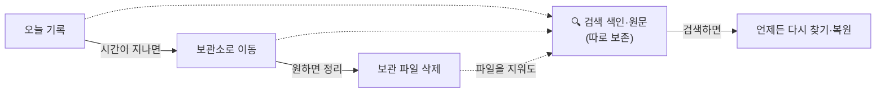
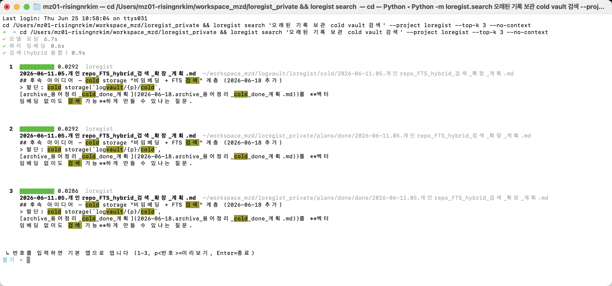
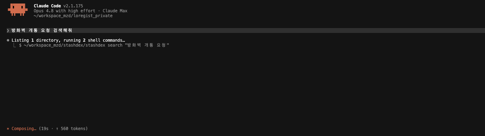
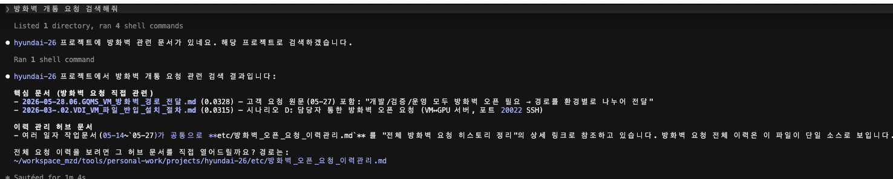
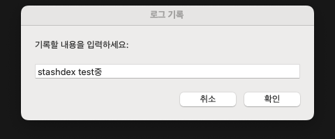

# stashdex

> 업무 메모를 쌓아두고, 필요할 때 의미가 비슷한 기록까지 찾아주는 개인용 검색 도구.

예전 결정이나 회의 결론을 다시 찾으려고 파일을 뒤진 적이 있다면, stashdex가 그 일을 대신합니다.

한 줄씩 기록해 두면 나중에 검색으로 관련 기록을 불러올 수 있습니다. AI(클로드)와 함께 쓰면 AI가 이 기록을 검색해 참고합니다.

---

## 개념적으로는

AI 도구 용어로 보면 stashdex는 이렇게 위치 지을 수 있습니다.

- 내 업무 기록을 자료로 삼아 관련 내용을 찾아 AI에 넣는 **개인용 RAG**(검색 기반 AI 활용)
- 단어가 아니라 의미로 찾는 **시맨틱(벡터) 검색**
- 세션을 넘어 쌓이는 AI의 **장기 기억**

이 비유를 더 풀어 쓴 대응표는 [ARCHITECTURE.md › 유사 개념](ARCHITECTURE.md#유사-개념)에 있습니다.

---

## 어쩌다 만들어졌나

처음부터 도구를 만들려던 건 아닙니다. 일하면서 생긴 불편을 하나씩 해결하다 보니 지금 모습이 됐습니다.

- 모든 일을 메모로 남기며 일했습니다.
- 다음 할 일을 파악하려 예전 기록을 매번 다시 읽는 게 번거로웠습니다. → 기록을 읽고 다음 작업을 정리하는 일을 자동화했습니다.
- 기록이 쌓이자 양이 너무 많아 원하는 내용을 찾기 어려웠습니다. → 핵심만 추린 정리본을 따로 두고, 단어가 아니라 의미로 찾는 검색을 도입했습니다.
- 오래된 메모는 계속 늘어납니다. → 오래된 건 보관소로 옮기되, 검색으로 언제든 다시 불러옵니다.

이 과정이 지금의 **기록 → 정리·보관 → 검색** 흐름이 됐습니다.

---

## 어떻게 동작하나

stashdex는 두 부분입니다. **본체**는 기록을 쌓고 의미로 검색하는 도구이고, **스킬**은 그 검색을 활용해 문서를 쓰고 갱신하는 Claude Code 도구입니다. 스킬이 써낸 문서는 다시 기록이 되어 검색에 잡힙니다 — 둘은 한 바퀴 도는 순환입니다.


아래는 본체의 세 단계입니다.

### ① 기록 — 한 줄 남기면 됩니다

회의 결정, 해결한 문제, 검토한 내용을 한 줄씩 적어 둡니다. 로그를 파일로 남겨도 됩니다. 형식이나 저장 위치는 신경 쓰지 않아도 됩니다. 단, **기록하지 않은 일은 나중에 찾을 수 없으니** 기억하고 싶은 건 가볍게라도 남겨 두는 게 좋습니다.

### ② 정리·보관 — 오래된 건 보관소로

모든 메모를 늘 앞에 두면 금세 어수선해집니다. stashdex는 최근 기록은 가까이 두고, **일정 기간이 지난 오래된 기록은 보관소로 옮깁니다.** 보관소로 옮겨도 검색에서는 사라지지 않습니다 — 검색하면 그대로 나오고, 원문도 다시 꺼내 볼 수 있습니다.

원한다면 **보관소에 쌓인 오래된 파일 자체를 정리(삭제)할 수도 있습니다.** 그래도 검색은 멀쩡합니다 — 파일과 별개로 **검색 색인과 원문이 따로 보존**되기 때문입니다. 즉 눈에 보이는 파일은 지워져도 내용은 검색 쪽에 남아, 파일을 지운 뒤에도 검색하면 다시 나오고 복원할 수 있습니다(**파일 → 검색 보관**).



### ③ 검색 — 의미가 비슷한 기록을 찾습니다

찾고 싶은 내용을 검색하면, 단어가 똑같지 않아도 **의미가 비슷한** 기록을 관련도 순으로 보여줍니다. (예: "방화벽 개통 요청"으로 검색해도 "포트 오픈 신청" 기록이 잡힙니다. "DB 연결 실패"와 "database connection failed"도 같은 기록을 찾습니다.)

**사람이 직접 검색 (TUI)**



> 검색하면 관련도 순으로 카드가 뜹니다. 번호를 입력하면 해당 기록의 원문을 바로 열 수 있습니다.

**Claude가 검색을 소비 (통합)**





AI(클로드)와 함께 쓸 때 특히 유용합니다. Claude가 `stashdex search`로 관련 기록을 컨텍스트에 주입하므로, 기록 전체를 읽지 않아도 답이 더 정확하고 토큰도 아낍니다. → 통합 설정은 [Claude Code 통합 설정](docs/public/USAGE.md#claude-code-통합-설정) 참조.

---

## 기록이 쌓이면 — 자동화로 이어집니다

기록은 그 자체로 끝이 아닙니다. 검색 가능한 기록이 쌓이면, 반복 업무를 대신해 주는 **스킬**(Claude Code에서 동작)이 그 기록을 활용합니다. 스킬은 당신의 기록을 검색해 참고하므로, **기록이 없으면 스킬도 참고할 내용이 없습니다.**

### 문서 작성 도우미로도 씁니다

로그나 메모를 던지면 스킬이 그것을 구조화된 문서로 바꾸고, 다음 할 일까지 제안합니다. README나 아키텍처 문서를 코드 변경에 맞춰 자동으로 갱신하거나, 누적된 문서에서 핵심 결정과 주제를 뽑아 지식 베이스를 만들기도 합니다.

### 스킬 목록

**일별 흐름**

| 스킬 | 역할 |
|---|---|
| `process-history` | 로그 파일 → 주제별 문서 기입 + 다음 할 일 제안 |
| `add-work` | 오늘 작업문서에 업무 항목 등록 |
| `carry-over` | 전일 미진행 항목을 오늘로 이월 |

**보고 생성**

| 스킬 | 역할 |
|---|---|
| `daily-report` | 아침/저녁 슬랙 데일리 보고 생성 |
| `daily-rollup` | 전 프로젝트 할 일 통합 목록 생성 |

**문서 관리**

| 스킬 | 역할 |
|---|---|
| `docs-manage` | 방화벽·인프라·운영 정보 공통 문서 조회·갱신 |
| `future-plan` | 미래 계획 등록·조회·데일리 승격 |

**지식 증류**

| 스킬 | 역할 |
|---|---|
| `handbook-update` | git diff 기반 README·ARCHITECTURE 등 산문 문서 자동 갱신 |
| `catalog-update` | 문서에서 topic·decision을 `_wiki/`로 자동 증류 |
| `wiki-update` | handbook-update → catalog-update 순 통합 갱신 오케스트레이터 |

스킬 상세(인자·호출 방법)는 [docs/public/SKILLS.md](docs/public/SKILLS.md), 설계 원리는 [ARCHITECTURE.md › Claude Code 스킬](ARCHITECTURE.md#claude-code-스킬)을 참고하세요.

### 무엇을 직접 하고, 무엇을 Claude에 맡기나

| 작업 | 방식 | 이유 |
|---|---|---|
| **기록 남기기** (journal/watch) | **직접(A)** — 더블클릭·단축키·`stashdex journal` | 1초가 생명. 마찰이 없어야 기록이 쌓인다 |
| **검색·조회** | **Claude에 위임(B)** | Claude가 `stashdex search`로 알아서 찾아 정리 |
| **보고 생성** | **Claude에 위임(B)** | `/daily-report` 또는 "아침 보고 만들어줘" |
| **문서화·이월** | **Claude에 위임(B)** | `/process-history`, `/carry-over` 또는 자연어 |
| **문서 갱신·위키** | **Claude에 위임(B)** | `/wiki-update` 또는 "README 갱신해줘" |

> **기록 캡처는 B2가 대체하지 않는다.** 더블클릭·단축키·`stashdex journal`이 계속 정답이다. B2(자연어 위임)는 쌓인 기록을 활용하는 단계를 자동화하는 것이지, 기록 행위 자체를 바꾸지 않는다.

---

## 시작하기

> **현재 macOS에서만 사용할 수 있습니다.** 처음 한 번은 설치가 필요합니다. 터미널이 익숙하지 않다면 **[설치 안내(SETUP.md) › 간편 키트](docs/public/SETUP.md)**를 따르거나, 가까운 개발 동료에게 "stashdex 간편 키트 설치"를 부탁하세요. 설치가 끝나면 아래처럼 쓸 수 있습니다.

### Claude Code에 말하기 — 가장 빠른 길

설치가 끝난 뒤 Claude Code를 열고 자연어로 말하면 됩니다. 슬래시 명령어도 동일하게 동작합니다.

**과거 이력 검색**

```
어제 결정한 내용 검색해줘
API 설계 관련 과거 기록 찾아줘
```

자연어로 요청하면, Claude가 `stashdex search`를 호출해 관련 기록을 관련도 순으로 찾아 정리해줍니다.

**스킬 호출**

| 자연어로 말하기 | 슬래시 명령 |
|---|---|
| "아침 데일리 보고 만들어줘" | `/daily-report morning` |
| "어제 못 한 항목 오늘로 이월해줘" | `/carry-over` |
| "오늘 작업에 DB 마이그레이션 추가해줘" | `/add-work DB_마이그레이션` |
| "README 최신 상태로 갱신해줘" | `/handbook-update --now` |
| "위키 전체 업데이트해줘" | `/wiki-update` |

인자 상세 → [SKILLS.md](docs/public/SKILLS.md)

> **검색** 동선이 동작하려면 각 프로젝트 CLAUDE.md에 검색 규칙 블록이 필요합니다. → [Claude Code 통합 설정](docs/public/USAGE.md#claude-code-통합-설정)

---

### 터미널 없이 — 더블클릭 / 단축키

가장 쉬운 방법입니다.

- **기록하기**: `stashdex-journal` 아이콘을 더블클릭하면 입력창이 뜹니다. 한 줄 적고 확인하면 끝입니다.
- **단축키로 기록**: macOS 단축키(예: `⌥Space`)로 어디서든 바로 입력할 수 있습니다.



설정 방법은 [사용 가이드(USAGE.md) › macOS 자동화](docs/public/USAGE.md)를 참고하세요.

### 명령어로 — 익숙하다면

```bash
stashdex journal "API 스펙 검토 완료, v2 엔드포인트 유지 결정"   # 기록
stashdex search "엔드포인트 결정"                              # 검색
```

기록은 자동으로 쌓이고, 검색하면 관련 기록이 관련도 순으로 나옵니다.

---

## 자주 묻는 것

- **기록한 내용이 사라지나요?** — 검색에서는 사라지지 않습니다. 오래된 기록은 보관소로 옮겨지고, 검색하면 다시 나오며 원문도 다시 볼 수 있습니다. (보관 파일을 직접 정리하더라도 원문은 검색 색인에 남아 복원됩니다.)
- **정해진 형식이 있나요?** — 없습니다. 평소 말하듯 한 줄 적으면 됩니다.
- **검색어가 정확해야 하나요?** — 아닙니다. 의미가 비슷하면 단어가 달라도 찾습니다. 단, 전부 빠짐없이가 아니라 관련도가 높은 것부터 보여줍니다.
- **다른 사람과 공유되나요?** — 아닙니다. 개인용이며, 프로젝트별로 따로 관리됩니다.

---

## 더 알아보기

기술적인 동작 원리나 전체 명령어가 궁금하다면(개발자용):

- [docs/public/SETUP.md](docs/public/SETUP.md) — 설치 단계별 안내 (간편 키트 포함)
- [docs/public/USAGE.md](docs/public/USAGE.md) — 전체 명령어·옵션·자동화·연동
- [docs/public/SKILLS.md](docs/public/SKILLS.md) — 스킬 목록·인자·호출 방법
- [ARCHITECTURE.md](ARCHITECTURE.md) — 설계 원리·구조·기술 상세
- [docs/public/log-format.md](docs/public/log-format.md) — 로그 형식·기록 규칙
