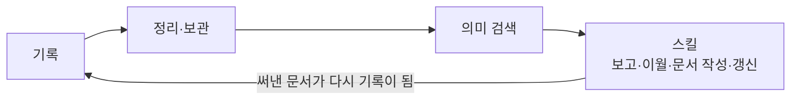

# loregist

> 업무 메모를 쌓아두고, 필요할 때 의미가 비슷한 기록까지 찾아주는 개인용 검색 도구.

예전 결정이나 회의 결론을 다시 찾으려고 파일을 뒤진 적이 있다면, loregist가 그 일을 대신합니다.

한 줄씩 기록해 두면 나중에 검색으로 관련 기록을 불러올 수 있습니다. AI(클로드)와 함께 쓰면 AI가 이 기록을 검색해 참고합니다.

---

## 어쩌다 만들어졌나

처음부터 도구를 만들려던 건 아닙니다. 일하면서 생긴 불편을 하나씩 해결하다 보니 지금 모습이 됐습니다.

- 모든 일을 메모로 남기며 일했습니다.
- 다음 할 일을 파악하려 예전 기록을 매번 다시 읽는 게 번거로웠습니다. → 기록을 읽고 다음 작업을 정리하는 일을 자동화했습니다.
- 기록이 쌓이자 양이 너무 많아 원하는 내용을 찾기 어려웠습니다. → 핵심만 추린 정리본을 따로 두고, 단어가 아니라 의미로 찾는 검색을 도입했습니다.
- 오래된 메모는 계속 늘어납니다. → 오래된 건 보관소로 옮기되, 검색으로 언제든 다시 불러옵니다.

이 과정이 지금의 **기록 → 정리·보관 → 검색** 흐름이 됐습니다.

---

## 어떻게 동작하나

loregist는 두 부분입니다. **본체**는 기록을 쌓고 의미로 검색하는 CLI이고, **스킬**은 그 검색을 활용해 문서를 쓰고 갱신하는 Claude Code 도구입니다. 스킬이 써낸 문서는 다시 기록이 되어 검색에 잡힙니다 — 둘은 한 바퀴 도는 순환입니다.



아래는 본체의 세 단계입니다.

### ① 기록 — 한 줄 남기면 됩니다

회의 결정, 해결한 문제, 검토한 내용을 한 줄씩 적어 둡니다. 형식이나 저장 위치는 신경 쓰지 않아도 됩니다. 단, **기록하지 않은 일은 나중에 찾을 수 없으니** 기억하고 싶은 건 가볍게라도 남겨 두는 게 좋습니다.

### ② 정리·보관 — 오래된 건 보관소로

모든 메모를 늘 앞에 두면 금세 어수선해집니다. loregist는 최근 기록은 가까이 두고, 오래된 기록은 보관소로 옮깁니다. 보관소로 옮겨도 검색에서는 사라지지 않습니다 — 검색하면 그대로 나오고, 원문도 다시 꺼내 볼 수 있습니다.

### ③ 검색 — 의미가 비슷한 기록을 찾습니다

찾고 싶은 내용을 검색하면, 단어가 똑같지 않아도 **의미가 비슷한** 기록을 관련도 순으로 보여줍니다. (예: "배포 실패"로 검색해도 "deploy 에러" 기록이 잡힙니다.)

AI(클로드)와 함께 쓸 때 특히 유용합니다. AI가 기록 전체를 읽는 대신 검색으로 추려진 관련 기록만 참고하므로, 답이 더 정확하고 토큰도 아낍니다.

---

## 기록이 쌓이면 — 자동화로 이어집니다

기록은 그 자체로 끝이 아닙니다. 검색 가능한 기록이 쌓이면, 반복 업무를 대신해 주는 **스킬**(Claude Code에서 동작)이 그 기록을 활용합니다. 스킬은 당신의 기록을 검색해 참고하므로, **기록이 없으면 스킬도 참고할 내용이 없습니다.**

### 문서 작성 도우미로도 씁니다

로그나 메모를 던지면 스킬이 그것을 구조화된 문서로 바꾸고, 다음 할 일까지 제안합니다. README나 아키텍처 문서를 코드 변경에 맞춰 자동으로 갱신하거나, 누적된 문서에서 핵심 결정과 주제를 뽑아 지식 베이스를 만들기도 합니다.

### 스킬 목록

**일별 흐름**

| 스킬 | 역할 |
|---|---|
| `process-history` | 로그 파일 → 주제별 문서 기입 + 다음 할 일 제안 |
| `add-work` | 오늘 작업문서에 업무 항목 등록 |
| `carry-over` | 전일 미진행 항목을 오늘로 이월 |

**보고 생성**

| 스킬 | 역할 |
|---|---|
| `daily-report` | 아침/저녁 슬랙 데일리 보고 생성 |
| `daily-rollup` | 전 프로젝트 할 일 통합 목록 생성 |

**문서 관리**

| 스킬 | 역할 |
|---|---|
| `docs-manage` | 방화벽·인프라·운영 정보 공통 문서 조회·갱신 |
| `future-plan` | 미래 계획 등록·조회·데일리 승격 |

**지식 증류**

| 스킬 | 역할 |
|---|---|
| `handbook-update` | git diff 기반 README·ARCHITECTURE 등 산문 문서 자동 갱신 |
| `catalog-update` | 문서에서 topic·decision을 `_wiki/`로 자동 증류 |
| `wiki-update` | handbook-update → catalog-update 순 통합 갱신 오케스트레이터 |

스킬 상세(인자·호출 방법)는 [docs/public/SKILLS.md](docs/public/SKILLS.md), 설계 원리는 [ARCHITECTURE.md › Claude Code 스킬](ARCHITECTURE.md#claude-code-스킬)을 참고하세요.

---

## 시작하기

> **현재 macOS에서만 사용할 수 있습니다.** 처음 한 번은 설치가 필요합니다. 터미널이 익숙하지 않다면 **[설치 안내(SETUP.md) › 비개발자 키트](docs/public/SETUP.md)**를 따르거나, 가까운 개발 동료에게 "loregist 비개발자 키트 설치"를 부탁하세요. 설치가 끝나면 아래처럼 쓸 수 있습니다.

### 터미널 없이 — 더블클릭 / 단축키

가장 쉬운 방법입니다.

- **기록하기**: `loregist-journal` 아이콘을 더블클릭하면 입력창이 뜹니다. 한 줄 적고 확인하면 끝입니다.
- **단축키로 기록**: macOS 단축키(예: `⌥Space`)로 어디서든 바로 입력할 수 있습니다.

설정 방법은 [사용 가이드(USAGE.md) › macOS 자동화](docs/public/USAGE.md)를 참고하세요.

### 명령어로 — 익숙하다면

```bash
loregist journal "API 스펙 검토 완료, v2 엔드포인트 유지 결정"   # 기록
loregist search "엔드포인트 결정"                              # 검색
```

기록은 자동으로 쌓이고, 검색하면 관련 기록이 관련도 순으로 나옵니다.

---

## 자주 묻는 것

- **기록한 내용이 사라지나요?** — 검색에서는 사라지지 않습니다. 오래된 기록은 보관소로 옮겨지고, 검색하면 다시 나오며 원문도 다시 볼 수 있습니다. (보관 파일을 직접 정리하더라도 원문은 검색 색인에 남아 복원됩니다.)
- **정해진 형식이 있나요?** — 없습니다. 평소 말하듯 한 줄 적으면 됩니다.
- **검색어가 정확해야 하나요?** — 아닙니다. 의미가 비슷하면 단어가 달라도 찾습니다. 단, 전부 빠짐없이가 아니라 관련도가 높은 것부터 보여줍니다.
- **다른 사람과 공유되나요?** — 아닙니다. 개인용이며, 프로젝트별로 따로 관리됩니다.

---

## 개념적으로는 (관심 있다면)

AI 도구 용어에 익숙하다면, loregist는 이렇게 위치 지을 수 있습니다.

- 내 업무 기록을 자료로 삼아 관련 내용을 찾아 AI에 넣는 **개인용 RAG**(검색 기반 AI 활용)
- 단어가 아니라 의미로 찾는 **시맨틱(벡터) 검색**
- 세션을 넘어 쌓이는 AI의 **장기 기억**

이 비유를 더 풀어 쓴 대응표는 [ARCHITECTURE.md › 유사 개념](ARCHITECTURE.md#유사-개념)에 있습니다. (용어가 낯설면 건너뛰어도 됩니다.)

---

## 더 알아보기

기술적인 동작 원리나 전체 명령어가 궁금하다면(개발자용):

- [docs/public/SETUP.md](docs/public/SETUP.md) — 설치 단계별 안내 (비개발자 키트 포함)
- [docs/public/USAGE.md](docs/public/USAGE.md) — 전체 명령어·옵션·자동화·연동
- [docs/public/SKILLS.md](docs/public/SKILLS.md) — 스킬 목록·인자·호출 방법
- [ARCHITECTURE.md](ARCHITECTURE.md) — 설계 원리·구조·기술 상세
- [docs/public/log-format.md](docs/public/log-format.md) — 로그 형식·기록 규칙
