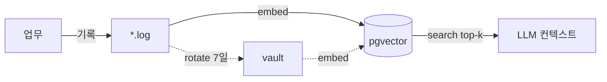
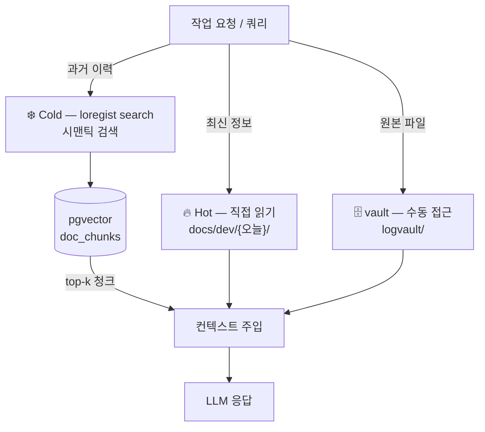
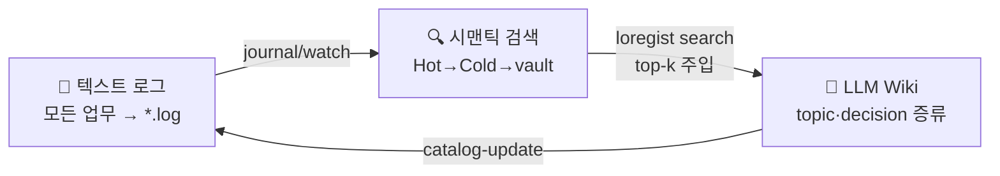

# loregist

> 업무 기록을 시맨틱 검색 가능한 개인 지식 베이스로 쌓고, 질문할 때 관련 있는 청크만 골라 LLM 컨텍스트에 주입하는 도구.

LLM과 길게 작업하다 보면 과거 이력을 찾으려 repo 전체를 Grep/Glob으로 훑게 되고, 컨텍스트는 노이즈로 채워진다. loregist는 업무를 텍스트 로그로 흘려보내 벡터 DB에 색인하고, 쿼리와 관련성 높은 상위 k개 청크만 꺼내 쓰게 한다. **무차별 탐색 대신 검색 랭킹으로 컨텍스트 우선순위를 매기는** 중앙 인프라다.

---

## 원리

한 장으로 보는 데이터 흐름 — 업무가 로그로 들어와 검색·소비되고, 오래되면 vault로 빠진다:



> 단계별 구현·전체 파이프라인은 [ARCHITECTURE.md › 데이터 플로우](ARCHITECTURE.md#데이터-플로우-전체) 참조.

### 1. 모든 업무를 텍스트 로그로 흘려보낸다

embed된 것만 검색되므로, 검색의 출발점은 기록이다. 회의 결정·해결한 문제·검토한 문서를 `*.log` 텍스트로 남기면 LLM이 청크 단위로 소비·생산할 수 있다. 기록되지 않은 업무는 검색 대상이 아니다.

### 2. 기록을 "온도"로 계층화한다

모든 기록을 항상 컨텍스트에 넣으면 윈도우가 금방 찬다. loregist는 접근 방식을 온도로 나눈다.



- **Hot** — 오늘 작업문서. LLM이 직접 읽는다.
- **Cold** — 시간이 지나 vault로 이동(rotate)된 기록. 검색으로만 닿는다. repo **밖**으로 빠지므로 파일시스템을 탐색해도 과거 이력에 걸리지 않는다 (`.gitignore`는 내용을 못 막고 CLAUDE.md 규칙은 soft boundary라, 물리적 이동만이 구조적 보장이 된다).
- **vault** — 원본 보관소. 전문(`doc_originals.full_text`)이 남아 삭제 후에도 복원 가능.

### 3. 질문할 때 관련 청크만 주입한다

쿼리를 임베딩해 코사인 유사도 top-k 청크만 반환한다. 전체 기록을 넘기지 않으므로 신호 대 노이즈 비가 높아지고 토큰 예산이 절약된다. 기본 검색 모드는 **hybrid**(벡터 + 키워드 RRF 융합)로, 골든셋 정확도 80% — 단독 모드(40~60%)보다 높다.

### 4. 누적된 지식은 LLM이 직접 증류한다

원시 로그가 검색의 한쪽 끝이라면, 반대쪽 끝은 정제된 지식이다. `catalog-update` 스킬이 텍스트 흐름에서 topic·decision을 뽑아 `_wiki/` 위키로 유지한다. 다량의 원시 기록은 검색 랭킹에, 소수의 정제 지식은 LLM 위키에 — 둘은 경쟁이 아니라 **파이프라인의 두 끝**이다.



---

## 유사 개념

loregist를 이미 아는 개념으로 위치 짓는다면:

| 개념 | loregist에서의 대응 |
|---|---|
| **RAG** (Retrieval-Augmented Generation) | 핵심 패턴 그 자체. 단, 외부 문서가 아니라 **자기 업무 로그**를 검색 코퍼스로 삼는 개인용 RAG. |
| **벡터 DB / 시맨틱 검색** | pgvector + 한국어 특화 임베딩 모델. 키워드가 아닌 의미로 과거 이력을 소환. |
| **LLM 장기 기억 (long-term memory)** | 세션을 넘어 누적되는 외부 기억 계층. 컨텍스트 윈도우 밖의 이력을 검색으로 되살린다. |
| **메모리 계층 / 캐시 (hot/cold tiering)** | 자주 쓰는 데이터는 가깝게(Hot=직접 읽기), 오래된 데이터는 멀리(Cold=검색)·아카이브(vault). OS의 캐시 계층과 같은 발상. |
| **지식 베이스 / 위키** | `_wiki/`의 topic·decision 인덱스. 단, 사람이 아니라 LLM이 로그에서 증류해 유지. |

요약하면 loregist는 **개인 업무 로그 위의 RAG + hot/cold 메모리 계층 + LLM이 유지하는 위키**의 결합이다.

---

## 지원 도구

### 기록 — 로그를 쌓는 입구

| 도구 | 역할 |
|---|---|
| `loregist journal "메시지"` | 오늘 날짜 `.log`에 타임스탬프와 함께 append |
| `loregist watch` | 디렉터리 감시 — 파일 변경 시 자동 embed |
| `github-digest.sh` / `jira-digest.sh` | GitHub 알림·Jira 업데이트를 `.log`로 변환해 append ([`scripts/examples/`](scripts/examples/)) |
| 직접 작성 | `logvault/{project}/YYYY-MM-DD.log` 형식으로 자유 기록 |
| macOS Shortcuts / launchd | 터미널 없이 단축키로 기록, 1시간마다 자동 embed (USAGE 참조) |

### 검색·색인 — CLI

```bash
loregist embed                  # 현재 프로젝트 임베딩 (--incremental: 변경분만)
loregist search "쿼리"          # hybrid 시맨틱 검색 (--mode fts / --all-projects / --json)
loregist rotate                 # Hot → vault 이동 (라이프사이클, 7일 초과분)
loregist project list           # 등록 프로젝트 목록
loregist catalog --project {p}  # _wiki/ topic·decision 인덱스 갱신
```

전체 명령·옵션은 [USAGE.md](docs/public/USAGE.md) 참조.

### 소비 — Claude Code 스킬

로그가 쌓이고 embed되면, 스킬이 `loregist search`로 관련 컨텍스트를 주입해 반복 작업을 자동화한다.

| 스킬 | 역할 |
|---|---|
| `add-work` | 오늘 작업문서에 업무 항목 등록 |
| `carry-over` | 전일 미완 항목을 오늘로 이월 |
| `daily-report` | 작업문서 + Jira/git log로 슬랙 데일리 보고 생성 |
| `daily-rollup` | 전 프로젝트 할 일 통합 |
| `process-history` | 히스토리 로그를 작업문서에 기입하고 다음 할 일 제안 |
| `catalog-update` | `_wiki/` topic·decision 자동 증류·갱신 |
| `docs-manage` / `future-plan` | 공통 문서 조회·갱신 / 미래 계획 관리 |

> 로그를 기록하지 않으면 스킬이 참조할 이력이 없다. **기록 → embed → 검색·스킬 활용**은 하나의 루프다.

### 멀티 프로젝트

프로젝트 단위로 검색 스코프가 나뉜다. cwd에서 현재 프로젝트를 자동 추론하고, `--all-projects`로 크로스 검색한다. 새 프로젝트 추가는 [`projects.toml`](projects.toml)에 블록 한 개를 더하는 것으로 끝난다 — 코드 편집 불필요.

---

## 빠른 시작

```bash
make setup                      # 의존성 설치 + pgvector 기동
loregist warmup                 # 임베딩 모델 다운로드 (최초 1회, ~450MB)
loregist project add            # 대화형 프로젝트 등록
loregist journal "오늘 한 일"   # 기록 (자동 embed)
loregist search "검색어"        # 시맨틱 검색
```

설치·환경변수·자동화 상세는 [USAGE.md](docs/public/USAGE.md) 참조.

---

## 더 알아보기

- [docs/public/SETUP.md](docs/public/SETUP.md) — 설치 단계별 안내 (클론 → 훅 → PATH → DB → 프로젝트 등록 → 비개발자 키트)
- [ARCHITECTURE.md](ARCHITECTURE.md) — 스택·컴포넌트·라이프사이클·DB 스키마 등 기술 상세
- [docs/public/USAGE.md](docs/public/USAGE.md) — 설치·명령어·연동·운영
- [docs/public/log-format.md](docs/public/log-format.md) — 로그 형식·청킹 규칙
